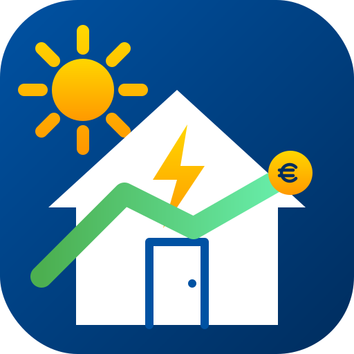
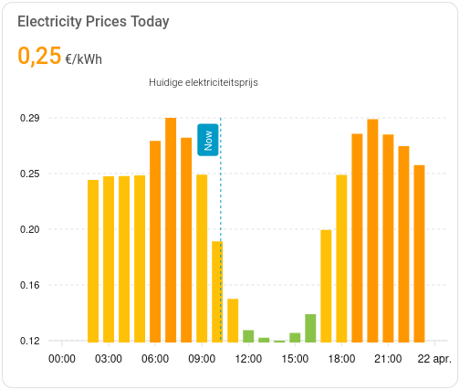

<p align="center">
  
</p>

# ANWB Energie Account for Home Assistant

A custom component for Home Assistant that natively integrates your ANWB Energie account. It securely fetches your electricity consumption, production, and cost data. 

## Features
*   **Native Energy Dashboard Support:** Seamlessly integrates with the built-in Home Assistant Energy dashboard.
*   **Hourly & Daily Statistics:** Import and export usage and costs are automatically added to Long-Term Statistics.
*   **Current Dynamic Price Sensor:** Provides the current hourly electricity price, along with today's and tomorrow's prices as attributes for charting (e.g., via ApexCharts).
*   **Monthly & Yearly Overviews:** Dedicated sensors for your current month and year totals.
*   **Diagnostics Support:** Download redacted diagnostics natively from the UI to easily share bug reports.
*   **Official Translation Support:** Fully supports English and Dutch seamlessly through Home Assistant's translation engine.

## Example Dashboards

Using the popular [ApexCharts Card](https://github.com/RomRider/apexcharts-card), you can create beautiful graphs that color-code the current electricity and gas prices.




### Electricity Prices
```yaml
type: custom:apexcharts-card
header:
  show: true
  title: Electricity Prices Today
  show_states: true
  colorize_states: true
graph_span: 24h
span:
  start: day
now:
  show: true
  label: Now
series:
  - entity: sensor.anwb_account_a_75cabfb0_huidige_elektriciteitsprijs
    type: column
    data_generator: |
      return entity.attributes.prices.map((record) => {
        return [new Date(record.start_time).getTime(), record.price];
      });
    color_threshold:
      - value: -1
        color: '#4CAF50'
      - value: 0
        color: '#8BC34A'
      - value: 0.15
        color: '#FFC107'
      - value: 0.25
        color: '#FF9800'
      - value: 0.35
        color: '#F44336'
      - value: 0.5
        color: '#E91E63'
```

### Gas Prices
```yaml
type: custom:apexcharts-card
experimental:
  color_threshold: true
header:
  show: true
  title: Gas Prices Today
  show_states: true
  colorize_states: true
graph_span: 24h
span:
  start: day
now:
  show: true
  label: Now
series:
  - entity: sensor.anwb_account_a_75cabfb0_huidige_gasprijs
    type: column
    data_generator: |
      return entity.attributes.prices.map((record) => {
        return [new Date(record.start_time).getTime(), record.price];
      });
    color_threshold:
      - value: 0
        color: '#4CAF50'
      - value: 1
        color: '#8BC34A'
      - value: 1.2
        color: '#FFC107'
      - value: 1.4
        color: '#FF9800'
      - value: 1.6
        color: '#F44336'
      - value: 1.8
        color: '#E91E63'
```

## Installation

### HACS (Recommended)
1. Open HACS in your Home Assistant instance.
2. Click the three dots in the top right corner and select **Custom repositories**.
3. Add the URL to this repository and select **Integration** as the category.
4. Click **Add**, then download the integration.
5. Restart Home Assistant.

## Configuration
1. Go to **Settings** -> **Devices & Services** -> **Add Integration**.
2. Search for **ANWB Energie Account**.
3. You will be provided with a login link. Click it to open the ANWB portal in your browser.
4. Log in with your ANWB account.
5. You will be redirected to a blank or error page. This is normal. **Copy the entire URL from your browser's address bar** and paste it back into Home Assistant.
