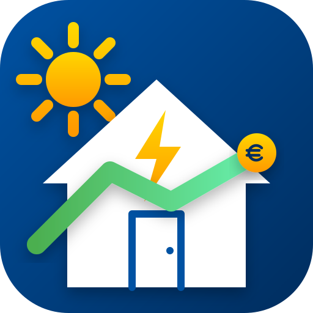
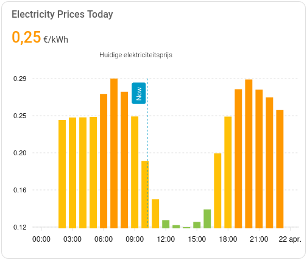

<p align="center">
  
</p>

# ANWB Energie Account for Home Assistant

An unofficial Home Assistant custom integration for Dutch ANWB Energie
customers. It imports electricity and gas usage, exposes dynamic tariffs, and
calculates tariff-based cost estimates for dashboards and long-term statistics.

This project is not affiliated with or supported by ANWB. It depends on ANWB's
cloud services and undocumented account APIs, which may change without notice.

[Releases](https://github.com/adrighem/ha-anwb-energie/releases) |
[Changelog](CHANGELOG.md) |
[Issues](https://github.com/adrighem/ha-anwb-energie/issues) |
[GPL-3.0 license](LICENSE)

## What it provides

- Electricity import and export totals for the current month and year.
- Gas totals for the current month and year when a gas contract is detected.
- Estimated variable usage costs and export values based on matching tariffs.
- Current all-in electricity and gas prices, plus the bare electricity market
  price.
- Price schedules for today and, when ANWB publishes them, tomorrow.
- Imported hourly usage and cost statistics for the Energy dashboard.
- English and Dutch entity translations.
- Redacted diagnostics for troubleshooting.

The integration is read-only. It provides sensors and statistics, but no
control actions.

## Requirements and scope

- Home Assistant 2026.3.0 or newer.
- An active ANWB Energie account.
- Internet access from Home Assistant and browser access to the ANWB login page.
- One ANWB account per Home Assistant instance.

If an ANWB login has multiple active energy accounts, the integration currently
uses the first account returned by ANWB. There is no account selector.

## Installation

### HACS

[![Open your Home Assistant instance and open this repository in HACS.][hacs-badge]][hacs-link]

This integration is included in the default HACS repository list.

1. Open the link above, or open HACS and search for **ANWB Energie Account**.
2. Open the repository and select **Download**.
3. Select the latest version.
4. Restart Home Assistant.

### Manual installation

1. Download the source archive for the
   [latest release](https://github.com/adrighem/ha-anwb-energie/releases/latest).
2. Copy `custom_components/anwb_energie_account` into the
   `/config/custom_components` directory on your Home Assistant instance.
3. Confirm that
   `/config/custom_components/anwb_energie_account/manifest.json` exists.
4. Restart Home Assistant.

Manual installations do not receive update notifications from HACS.

## Configuration

1. Go to **Settings** > **Devices & services**.
2. Select **Add integration** and search for **ANWB Energie Account**.
3. Open the generated login link in your browser.
4. Sign in on the ANWB page.
5. ANWB redirects the browser to a blank or error page. This is expected.
6. Copy the entire URL from the browser address bar and paste it into the
   original Home Assistant setup form.
7. Submit the form.

> **Security:** The redirected URL contains a short-lived authorization code and
> login transaction data. Paste it only into the active Home Assistant setup
> form. Never share it in an issue, log, screenshot, or message. If setup is
> interrupted, start a new flow instead of reusing the URL.

Configuration is UI-only. No YAML or separate API credentials are required.

## Data updates

| Data | Refresh behavior |
| --- | --- |
| Account usage | Polled every 6 hours from ANWB's account cache. It is not real-time meter data. |
| Tariffs | Checked every 30 minutes. The current-price sensor advances from the cached schedule on each hour. |
| Tomorrow's electricity tariffs | Requested after 13:00 local time and exposed when ANWB has published a complete schedule. |
| Tomorrow's gas tariffs | Requested after 06:00 local time and exposed when ANWB has published a complete schedule. |

The integration retains complete public tariffs for closed periods so restarts
and temporary API failures do not force the same tariff data to be fetched
again.

## Entities

The names below are the English display names. Home Assistant may translate
them and may generate localized `sensor.*` entity IDs. Find the exact IDs for
your installation under **Settings** > **Devices & services** > **Entities**.

### Electricity

| Entity | Unit | Description |
| --- | --- | --- |
| `Electricity import month to date` | kWh | Imported electricity in the current calendar month. |
| `Electricity export month to date` | kWh | Exported electricity in the current calendar month. |
| `Electricity import year to date` | kWh | Imported electricity in the current calendar year. |
| `Electricity export year to date` | kWh | Exported electricity in the current calendar year. |
| `Estimated electricity import usage cost month to date` | € | Variable import cost estimated from hourly usage and all-in tariffs. |
| `Estimated electricity export value month to date` | € | Export value estimated from hourly export and all-in tariffs. |
| `Estimated electricity import usage cost year to date` | € | Estimated variable import cost for the current year. |
| `Estimated electricity export value year to date` | € | Estimated export value for the current year. |
| `Electricity current all-in price` | €/kWh | Current all-in tariff. The `prices` attribute contains available schedules. |
| `Electricity current bare market price` | €/kWh | Current bare market price without the other all-in components. |

### Gas

Gas entities are created only when current-month or year-to-date account data
indicates that the account has gas. They are added automatically if gas is
detected later.

| Entity | Unit | Description |
| --- | --- | --- |
| `Gas usage month to date` | m³ | Gas usage in the current calendar month. |
| `Gas usage year to date` | m³ | Gas usage in the current calendar year. |
| `Estimated gas usage cost month to date` | € | Variable gas cost estimated from usage and matching all-in tariffs. |
| `Estimated gas usage cost year to date` | € | Estimated variable gas cost for the current year. |
| `Gas current all-in price` | €/m³ | Current all-in gas tariff. The `prices` attribute contains available schedules. |

ANWB does not expose an explicit gas-contract flag through the data used by the
integration. Gas availability is inferred from account data and revalidated at
the start of a new year. Temporary API gaps do not remove registered entities.

### Long-term statistics

The integration imports separate hourly statistics for:

- electricity import and export usage;
- estimated electricity import cost and export value; and
- gas usage and estimated gas cost, when applicable.

Their display names start with `ANWB Account <account number>`. Raw statistic
IDs start with `anwb_energie_account:` and can be found under
**Developer tools** > **Statistics**.

On first installation, hourly statistics are backfilled for the current
calendar month. Older months are not rebuilt automatically. Daily, monthly, and
yearly views in Home Assistant are aggregates of those hourly statistics.

If the statistics are not visible immediately, allow the initial ANWB refresh
and one Recorder statistics cycle to complete. Also confirm that Recorder is
not configured to exclude the integration's sensors.

## Energy dashboard

Go to **Settings** > **Dashboards** > **Energy**. Use the imported ANWB
statistics so hourly usage and its matching tariff stay aligned.

### Electricity grid

| Energy setting | Select |
| --- | --- |
| Grid consumption | `ANWB Account <account number> Import Usage` |
| Grid consumption cost | Select **Use an entity tracking total costs**, then `ANWB Account <account number> Import Cost` |
| Return to grid | `ANWB Account <account number> Export Usage` |
| Return compensation | Select **Use an entity tracking total costs**, then `ANWB Account <account number> Export Cost`, only if you accept the export estimate described below |

### Gas source

| Energy setting | Select |
| --- | --- |
| Gas consumption | `ANWB Account <account number> Gas Usage` |
| Gas cost | Select **Use an entity tracking total costs**, then `ANWB Account <account number> Gas Cost` |

Do not use **Use an entity with current price** with the ANWB usage entities.
Usage arrives in six-hour batches, so Home Assistant would apply one current
price to a multi-hour usage change. The imported cost statistics instead match
each usage interval to its tariff.

Do not select month-to-date or year-to-date overview sensors as substitutes for
the imported hourly statistics. Those sensors are intended for entity cards,
automations, and summary dashboards.

### Export compensation

The integration's export statistic and export-value entities apply the all-in
tariff to every exported kWh. They are estimates, not final-settlement values.

The Dutch annual net-metering scheme applies through 31 December 2026 and
[ends on 1 January 2027][net-metering]. The integration does not split annual
export into netted and surplus portions, and it does not model contract-specific
settlement rules from 2027 onward. Leave return compensation unset if exact
invoice reconciliation matters.

## Cost estimates

All cost entities and imported cost statistics are tariff estimates. They are
not amounts billed by ANWB.

- Month-to-date values match `HOUR` usage to `HOUR` all-in tariffs.
- Year-to-date values combine the current month's hourly calculation with
  `DAY` usage and tariffs for completed prior months.
- January has no completed prior month, so its year-to-date estimate uses only
  hourly data.
- Every non-zero usage interval must have a matching tariff.
- Current-month and prior-month usage aggregates must agree within a small
  rounding tolerance.

If coverage or reconciliation is incomplete, the affected estimate becomes
unavailable instead of silently treating missing prices as zero. Failed or
partial tariff responses remain retryable and do not overwrite valid cached
tariffs.

Clean installations do not create combined total-cost sensors with generic
fixed charges. Use the [cost calculation guide](docs/cost-calculations.md) to
build account-specific totals from the charges on your contract or invoice.
That guide also documents the formulas and availability behavior in more
detail.

### Upgrades and legacy entities

Older names such as `Yearly import usage`, `Monthly import usage`, and
`Current electricity price` are compatibility aliases. Clean installations do
not create them. User-enabled or user-managed aliases remain available so
existing dashboards and automations continue to work. Untouched aliases that
were still disabled by the integration are removed.

Fixed-charge and combined-total entities are also compatibility-only. When a
usable account-cache fixed-charge total is unavailable, their full-month
fallback is:

- electricity: €8.50 delivery charges, €39.73 network charges, and
  -€52.41 energy-tax reduction;
- gas: €8.50 delivery charges and €17.50 network charges.

These values may not match the account, network region, or current contract.
The `fixed_cost_source` attribute reports either `account_cache` or
`hardcoded_fallback`.

Review dashboards, automations, and history before removing a legacy entity.

## Example dashboards

These examples require the
[ApexCharts Card](https://github.com/RomRider/apexcharts-card), installed
separately through HACS. Add a **Manual** card to a dashboard and paste the
example YAML.

Replace each `sensor.your_account_*` placeholder with the matching entity ID
from **Settings** > **Devices & services** > **Entities**. For the historic
usage example, find the exact `anwb_energie_account:*` IDs under
**Developer tools** > **Statistics** and replace the example IDs.



<details>
<summary>Electricity prices</summary>

```yaml
type: custom:apexcharts-card
experimental:
  color_threshold: true
header:
  show: true
  title: Electricity Prices Today
  show_states: true
  colorize_states: true
graph_span: 24h
span:
  start: day
now:
  show: true
  label: Now
series:
  - entity: sensor.your_account_electricity_current_all_in_price
    type: column
    data_generator: |
      return (entity.attributes.prices ?? []).map((record) => {
        return [new Date(record.start_time).getTime(), record.price];
      });
    color_threshold:
      - value: -1
        color: '#4CAF50'
      - value: 0
        color: '#8BC34A'
      - value: 0.15
        color: '#FFC107'
      - value: 0.25
        color: '#FF9800'
      - value: 0.35
        color: '#F44336'
      - value: 0.5
        color: '#E91E63'
```

Set `graph_span: 48h` to include tomorrow after ANWB publishes the schedule.

</details>

<details>
<summary>Gas prices</summary>

```yaml
type: custom:apexcharts-card
experimental:
  color_threshold: true
header:
  show: true
  title: Gas Prices Today
  show_states: true
  colorize_states: true
graph_span: 24h
span:
  start: day
now:
  show: true
  label: Now
series:
  - entity: sensor.your_account_gas_current_all_in_price
    type: column
    data_generator: |
      return (entity.attributes.prices ?? []).map((record) => {
        return [new Date(record.start_time).getTime(), record.price];
      });
    color_threshold:
      - value: 0
        color: '#4CAF50'
      - value: 1
        color: '#8BC34A'
      - value: 1.2
        color: '#FFC107'
      - value: 1.4
        color: '#FF9800'
      - value: 1.6
        color: '#F44336'
      - value: 1.8
        color: '#E91E63'
```

</details>

<details>
<summary>Yesterday's electricity import and export</summary>

```yaml
type: custom:apexcharts-card
header:
  show: true
  title: Historic Usage (Yesterday)
graph_span: 24h
span:
  start: day
  offset: -1d
stacked: true
yaxis:
  - decimals: 2
series:
  - entity: sensor.your_account_electricity_import_month_to_date
    name: Import
    type: column
    color: '#3498db'
    data_generator: |
      const statisticId =
        'anwb_energie_account:import_usage_a_xxxxxxxx';
      const stats = await hass.callWS({
        type: 'recorder/statistics_during_period',
        start_time: start.toISOString(),
        end_time: end.toISOString(),
        statistic_ids: [statisticId],
        period: 'hour',
      });
      return (stats[statisticId] ?? []).map((row) => [
        row.start,
        row.state,
      ]);
  - entity: sensor.your_account_electricity_export_month_to_date
    name: Export
    type: column
    color: '#f1c40f'
    invert: true
    data_generator: |
      const statisticId =
        'anwb_energie_account:export_usage_a_xxxxxxxx';
      const stats = await hass.callWS({
        type: 'recorder/statistics_during_period',
        start_time: start.toISOString(),
        end_time: end.toISOString(),
        statistic_ids: [statisticId],
        period: 'hour',
      });
      return (stats[statisticId] ?? []).map((row) => [
        row.start,
        row.state,
      ]);
```

</details>

## Privacy and security

- Authentication takes place on ANWB's login page. The integration does not
  collect the ANWB password.
- Home Assistant stores the OAuth tokens in the integration's config entry.
- The integration's own persistent tariff cache contains public tariff data
  only, not account usage or credentials.
- Home Assistant Recorder stores entity history and the imported usage and cost
  statistics according to the instance's Recorder configuration.
- Diagnostics redact known account identifiers, addresses, and tokens. Always
  inspect a diagnostics file before sharing it publicly.

## Troubleshooting and support

### The integration is not available after installing it

Confirm that Home Assistant is version 2026.3.0 or newer, that HACS completed
the download, and that Home Assistant was restarted afterward.

### Login fails or the callback URL is rejected

Start a new configuration or reauthentication flow and use the callback URL
generated by that same flow. The URL contains one-time transaction values and
must not be reused or edited.

### An entity or statistic is missing from the Energy dashboard

Wait for the initial account refresh and a Recorder statistics cycle. Then
check **Developer tools** > **Statistics** for the ANWB statistic and any
reported issue. Also confirm that Recorder is not excluding the integration's
sensors. Home Assistant's
[missing Energy entity checklist][energy-troubleshooting] covers the required
device class, state class, unit, and statistics checks.

### A cost estimate is unavailable

This normally means that usage is missing a matching tariff or that ANWB's
hourly, daily, and monthly aggregates do not reconcile. Wait for the next
scheduled refresh. If the problem persists, reload the integration and inspect
its diagnostics.

### Gas entities are missing

Gas entities appear only after current-month or year-to-date ANWB data indicates
a gas contract. They are added automatically when gas is detected. If the ANWB
portal shows gas data but the entities remain absent after a refresh, include
diagnostics in an issue.

### Reporting an issue

1. Go to **Settings** > **Devices & services**.
2. Open **ANWB Energie Account**.
3. Open the three-dot menu and select **Download diagnostics**.
4. Review the file and remove anything you do not want to share.
5. Open a [GitHub issue](https://github.com/adrighem/ha-anwb-energie/issues)
   with the integration version, Home Assistant version, symptoms, relevant
   log messages, and diagnostics.

Never include an ANWB login URL, callback URL, authorization code, or token.

## Removal

1. Go to **Settings** > **Devices & services**.
2. Open **ANWB Energie Account**, open the three-dot menu, and select
   **Delete**.
3. In HACS, open the repository, open its three-dot menu, and select
   **Remove**.
4. Restart Home Assistant.

Removing the integration does not purge existing Home Assistant history,
external statistics, backups, or the integration's persisted public tariff
cache. Manage Recorder retention separately if those records also need to be
removed.

## Development

Contributions are welcome. The repository uses Python 3.14 in CI. Before
opening a pull request, run:

```bash
python -m pip install -r requirements_test.txt
python -m ruff check .
python -m pytest
python -m compileall custom_components tests
```

Implementation notes about the undocumented ANWB API are in
[docs/api-observations.md](docs/api-observations.md). The observed schema is in
[openapi.yaml](openapi.yaml).

[hacs-badge]: https://my.home-assistant.io/badges/hacs_repository.svg
[hacs-link]: https://my.home-assistant.io/redirect/hacs_repository/?owner=adrighem&repository=ha-anwb-energie&category=integration
[net-metering]: https://www.rijksoverheid.nl/themas/klimaat-milieu-en-natuur/energie-thuis/salderingsregeling
[energy-troubleshooting]: https://www.home-assistant.io/docs/energy/faq/#troubleshooting-missing-entities
